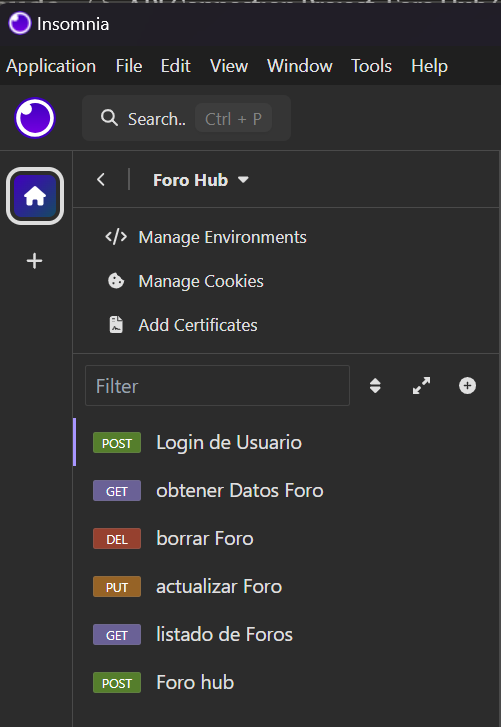
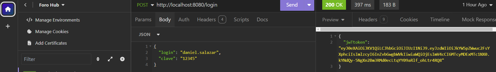
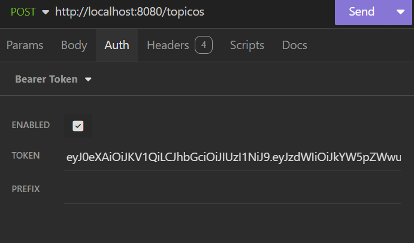

# Foro Hub Challenge

El proyecto establece una conexión a una API para realizar solicitudes como POST, GET, DELETE y PUT. No se cuenta con un front-end, por lo que utilizamos Insomnia para realizar estas solicitudes. El propósito del proyecto es poner en práctica lo aprendido en los cursos, haciendo uso de SpringBoot y conexiones a una base de datos para almacenar la información enviada por el usuario o la API. Además, se implementó un sistema de seguridad con JWT. Los usuarios deben realizar un login para obtener un token, y una vez registrado, podrán realizar todas las operaciones disponibles en el programa.

## Requisitos Previos

* **Insomnia**: Para validar el programa.
* **Java 17**: La versión utilizada en el desarrollo.
* **MySQL**: Versión `mysql-installer-web-community-8.0.37.0` para la conexión a la base de datos.


## Instalación

1. Clona el repositorio del proyecto desde GIT:

   ```bash
   git clone <URL_del_repositorio>

2. Configura Insomnia para realizar las solicitudes a la API. Crea los parámetros de la siguiente manera:
    


3. Asegúrate de que las tablas hayan sido creadas en la base de datos y agrega manualmente los datos de login en la tabla de usuarios:

   ```sql
    INSERT INTO usuarios (usuario, clave) VALUES ('daniel.salazar', '$2a$04$tVyuL6rKlqnsNAmsAil.ROICpuh7LofzxDyIUGecHnfaCBp1PJr26');

4. Configura los parámetros de conexión a la base de datos en el archivo application.properties de SpringBoot. Adaptalos de tal manera que se ajusten a los parametros de tu maquina.

    ```Java
    spring.datasource.url=jdbc:mysql://localhost:3308/foro_hub
    spring.datasource.username=root
    spring.datasource.password=Contraseña_propia

5. En Insonmia una vez creadas las pestañas, cada una contendra lo siguiente:
     
    - 

    ```Java
    {
	"login": "daniel.salazar",
	"clave": "12345"
    }
url: http://localhost:8080/login

Se debe de colocolar en la parte superior donde nos esta solicitando el url


## Uso
Para ejecutar el proyecto, utiliza el siguiente comando en tu terminal:
bashCopy./mvnw spring-boot:run
Ejemplos de Uso en Insomnia
Para realizar una solicitud de autenticación, utiliza el siguiente JSON en Insomnia:

    json 
    {
    "usuario": "daniel.salazar",
    "clave": "12345"
    }

Una vez autenticado, podrás usar el token generado para realizar solicitudes a las diferentes rutas disponibles en la API.

El cual debera de ponerse en las otras solicitudes, ya que que si no se coloca arrojara error todo el tiempo.





Contribución
Para contribuir al proyecto, sigue estos pasos:

Haz un fork del repositorio.
Crea una rama nueva (git checkout -b feature/nueva-funcionalidad).
Realiza tus cambios y haz un commit (git commit -m 'Agrega nueva funcionalidad').
Envía tus cambios al repositorio remoto (git push origin feature/nueva-funcionalidad).
Abre una solicitud de extracción (pull request).

Licencia
Este proyecto no tiene una licencia especificada.

Contactos
Para preguntas o soporte, puedes contactarme a través de [daniel_hal1_@hotmail.com].

